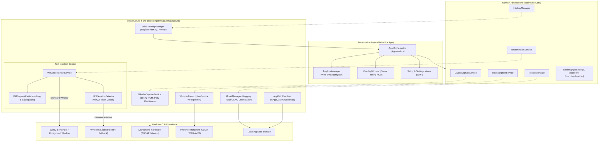
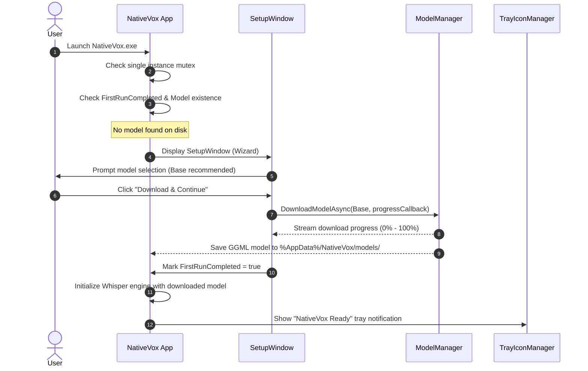
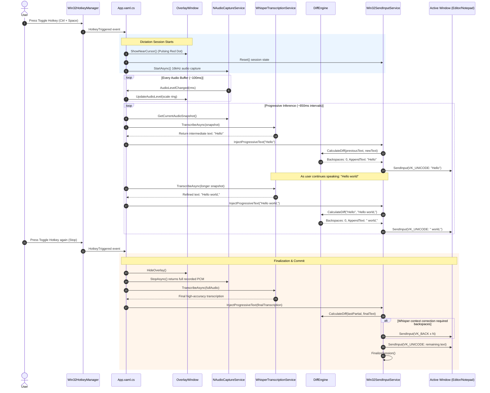
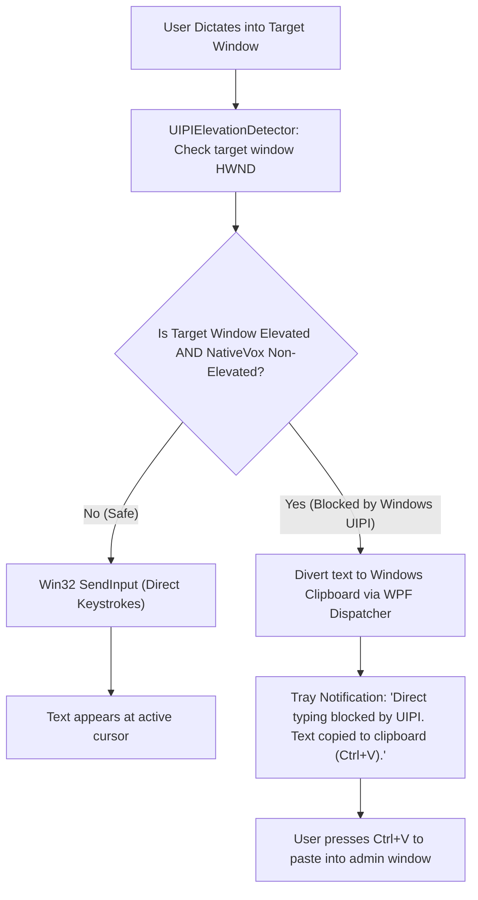
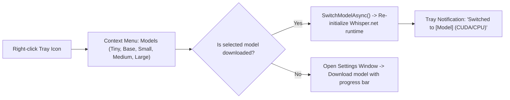

# NativeVox Architecture & User Flows

This document details the system architecture and interactive user flows for **NativeVox**, rendered in Mermaid format.

---

## 1. System Architecture

NativeVox employs a **Clean, Layered Architecture** separating the WPF presentation layer, core domain abstractions, and OS/hardware interop infrastructure.

### Component Breakdown

| Layer | Key Components | Responsibility |
| :--- | :--- | :--- |
| **Presentation** | `App.xaml.cs`, `TrayIconManager`, `OverlayWindow` | Single-instance Mutex lifecycle, global state coordination, non-activating floating HUD (`WS_EX_NOACTIVATE`), system tray icon with dynamic model menu. |
| **Core** | `ITranscriptionService`, `IAudioCaptureService`, `ITextInjectionService` | Inversion of control interfaces, immutable domain models, and settings state. Zero dependencies on OS APIs. |
| **Whisper Engine** | `WhisperTranscriptionService`, `ModelManager` | Manages native Whisper runtime lifecycle, CUDA execution provider initialization with CPU fallback, and asynchronous model downloading from Hugging Face. |
| **Audio Engine** | `NAudioCaptureService` | 16kHz mono 16-bit PCM streaming, continuous audio RMS level calculation (driving the pulsing HUD), and Polly fault recovery policies. |
| **Injection Engine** | `Win32SendInputService`, `DiffEngine`, `UIPIElevationDetector` | Progressive diff-and-backspace algorithm (`DiffEngine`), native Unicode input simulation (`SendInput`), and Windows UIPI elevation detection with clipboard fallback. |

---

## 2. User Flows

### 2.1 First-Run Onboarding Flow

Triggered on fresh installation or when no Whisper GGML model is detected.

---

### 2.2 Live Dictation & Progressive Typing Flow

The primary interactive loop when dictating into any document, IDE, or chat app.

---

### 2.3 UIPI Elevation Guard Flow

Handles edge cases such as typing into Administrator consoles (Task Manager, Admin Command Prompts, Registry Editor).

---

### 2.4 Runtime Model Switching Flow

Accessible on the fly via the Windows System Tray without restarting the application.

